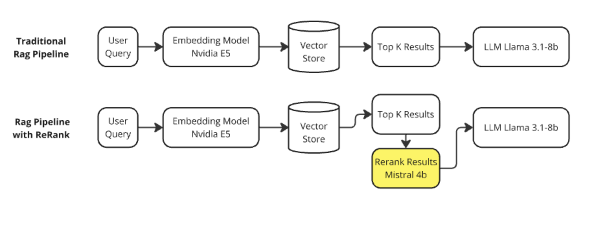
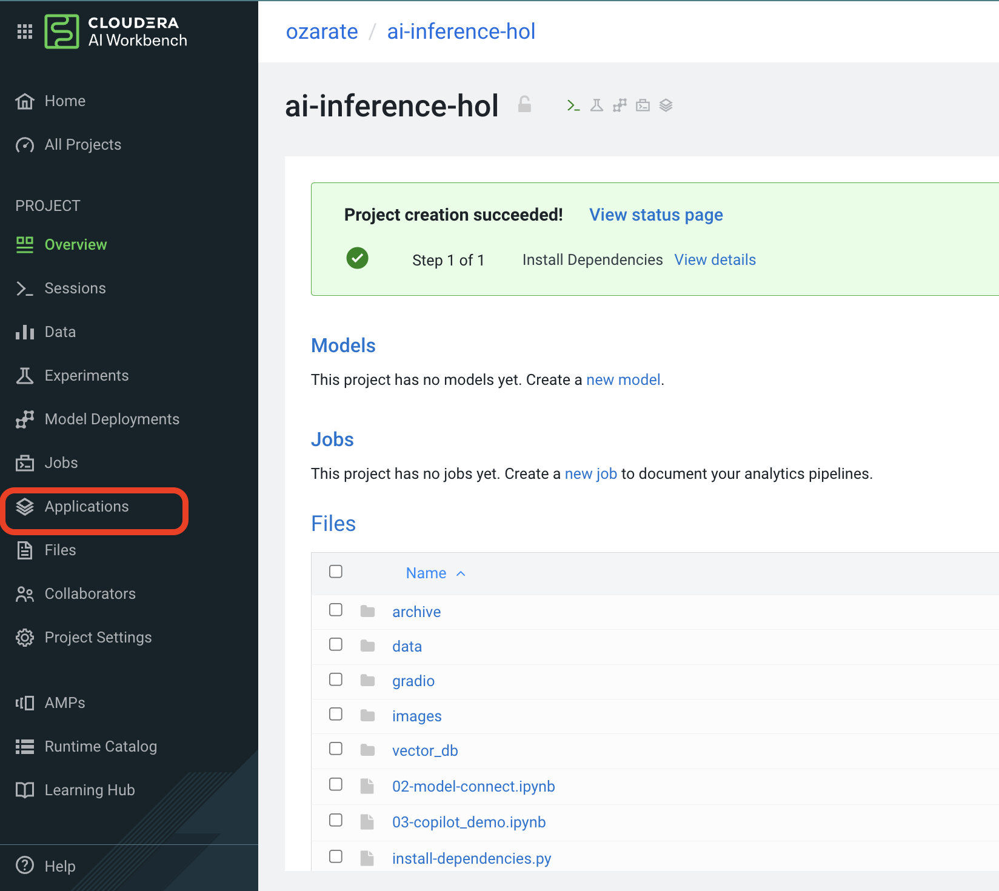
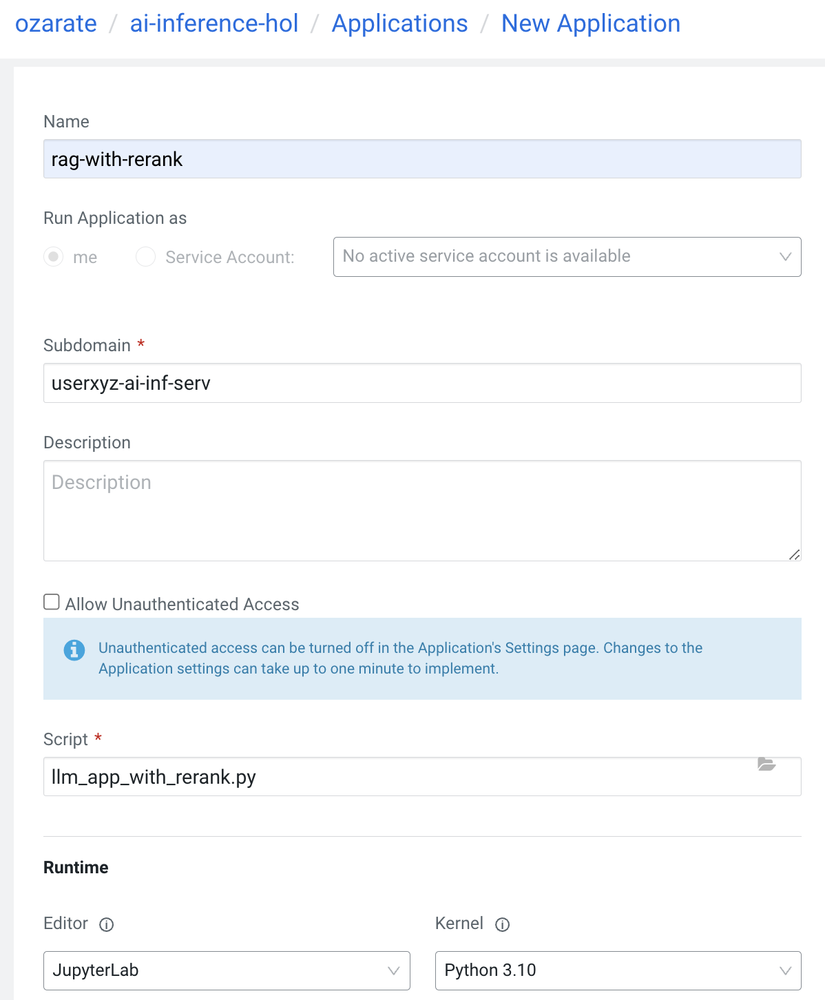
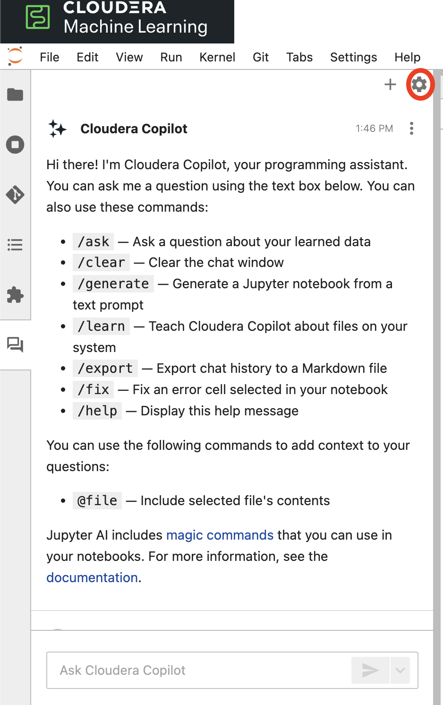
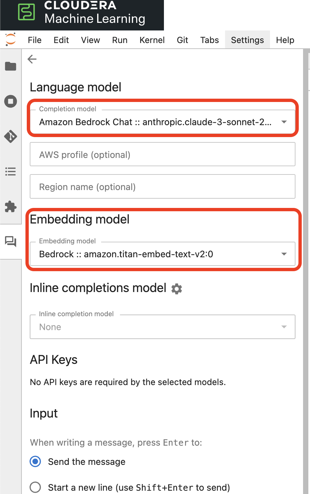
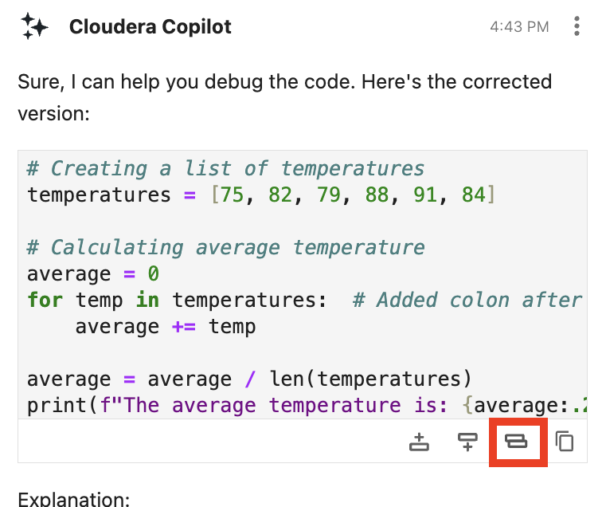
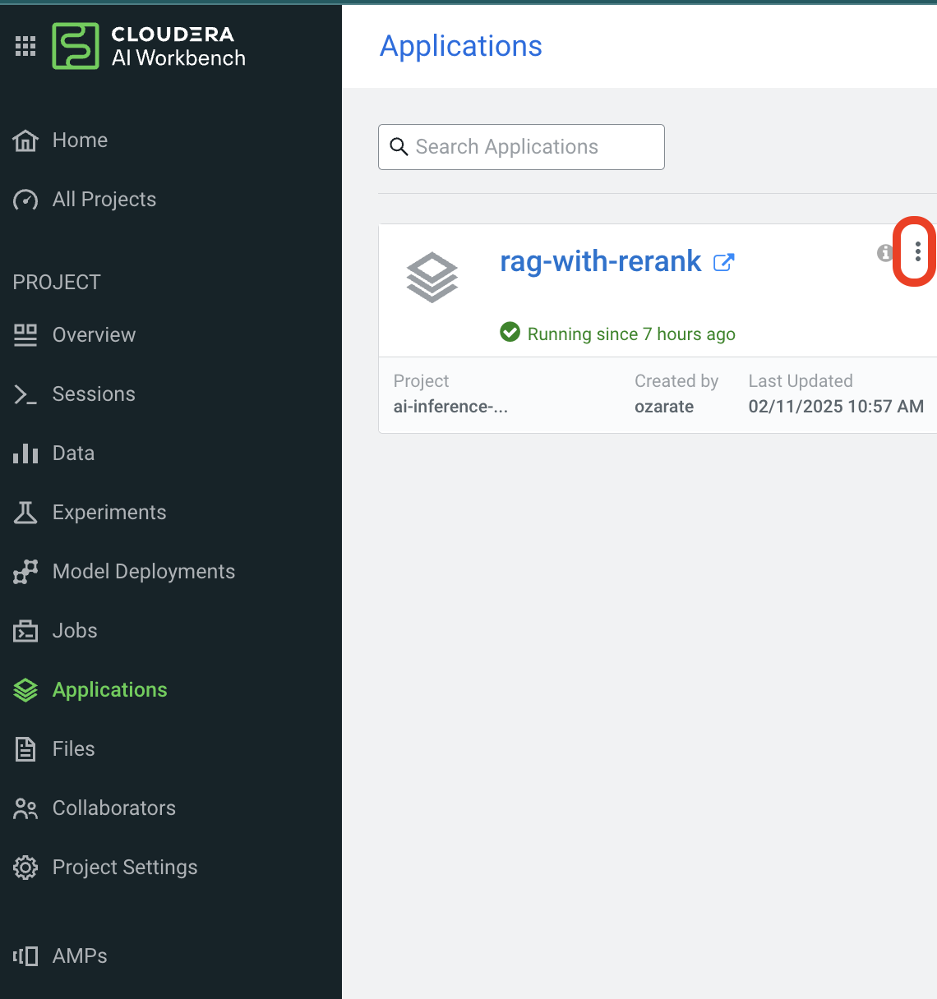
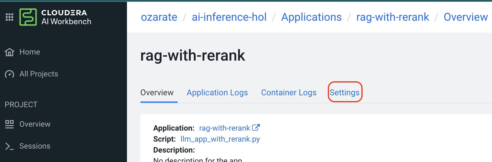

# Welcome to Cloudera SKO '26 Hands-On Lab

Hello and welcome to the Cloudera SKO '26 Hands-On Lab! We're excited to have you join us as we dive into the world of AI and machine learning with Cloudera. This lab is designed to give you a comprehensive overview of the Cloudera AI Inference Server and equip you with the skills to register and utilize models effectively.

## What You'll Learn

In this hands-on lab, you will:

- **Explore the Cloudera AI Inference Server**: Get an in-depth look at how the Cloudera AI Inference Server operates and understand its key features.
- **Register Models**: Learn the step-by-step process of registering your machine learning models with the Cloudera AI Inference Server.
- **Utilize Models with a Notebook**: Discover how to integrate and use your registered models within a Jupyter notebook environment for seamless data analysis and model inference.
- **Hands on with Model endpoints**: use a choice of apis to connect to a model enpoint. Learn how to swap out model enpoints. Using models in production. 

## AI Inferencing Services Hands-on Lab

### Overview

This hands-on lab provides a comprehensive walkthrough of AI model deployment, integration, and benchmarking. Through a series of guided exercises, participants will gain practical experience with various aspects of AI inferencing services, from model deployment to performance evaluation.

### Lab Structure

This lab consists of 7 steps, with an estimated total duration of 60 minutes.

### Introduction to Cloudera AI Inference Server

- Overview of the server architecture
- Key features and benefits

### Step 1: Model Registration

- Step-by-step guide to registering a model
- Best practices for model management
- Intro: Using the model in a Jupyter notebook

For the first section, we'll be using a reprise demo. To guide you through the demo, please see folling link

[SKO Reprise][(https://app.getreprise.com/edit4/preview/1yQ8zRX/)]

### Step 2: JupyterLab and API Integration (20 minutes)

In this section, you will:

* Explore options for API to contect to model endpoint
* Intro: interacting with a model
* Model interoperability - exploring model portability
* Explore a Rag Pipeline with mulitple AI inference models integrated.

* Understand reranking model capabilities
* Practice API integration for model usage

**Step by step guide**

#### Jupyter Notebook

**Prerequisites**: Before getting started. Let's learn how we connect to a model end point. 

Starting from from main dashboard, navigate to Cloudear AI. 

If CAI is somewhat new to you take a moment to familiarize yourself with the entry page of CAI. To the right we have the workbences, kubernetes pods that allow use to house and manage our AI projects. On the left column we can see many our our AI services. We're going explore model endpoints. Click on model endpoints. 

See the models that are deployed. For this step we'll be using the following models:

- Test-model-llama-8b-v2
- deepseek-r1-distill-llama-8b

Let's walk through the first model example, for LLama 3.1 8b. We want to collect the following

1. Model endpoint (item 1)
2. Model ID

**Important** 
carefully review the model endpoint url. Remove the tail end of the url, after 'v1'

  - Copy the endpoint URL (remove everything after /v1) for example :
   - `https://ai-inference.ainf-cdp.vayb-xokg.cloudera.site/...../modelxyz/openai/v1/chat/completions`
   - would be converted to :
   - `https://ai-inference.ainf-cdp.vayb-xokg.cloudera.site/...../modelxyz/openai/v1`

Go to our workbench : (ai-inferene-hol)

You'll see your project already available for you, with your user name. 

Create session. Pick python 3.10 kernal and Jupyterlab editor. 

Open the `02-model-connect.ipynb` notebook.

Feed the following variables:

Rince and repeat - repeat the same steps for the Deepseek R1 model. Use the next cell, and feed `ds_base_url` and `ds_model_name`.

Next follow notebook instructions

#### Rag application... reimagined. 

We've seen chatbots with rag agents, We'll look at an application, where we can update the model used on the fly. Have 2 concurrent converstations with 2 models. 
Then we'll see a leveling up of our traditional rag architecture.

So you've probably seen the traditional rag pipeline, where we use a similarity approach to identify best chunks to retrieve. We improve on this architecture to add a re-ranking to 're-rank' most relavent chunks to be sent to the LLM. 

Let's now launch the application!

Make sure you're in the context of your project, and go to 'applications'

Configure applicaiton as shown below. **Ensure you use a prefix with your username to ensure all participants have a unique domain**

### Step 4: Copilot (8 minutes)

* Learn how to use your favorite model to super charge you coding.

Let's start by going back to your session. In case the session expired, start a new one with same configuration as in previous step.
To access copilot featurs click on the icon at the bottom of the left part of the screen, as seen below.

Here you get some useful commands for interacting with copilot.

Next, select the settings gear icon on the top right, as shown. Here you can configure your embedding model as well as your language model.

Open the `03-copilot-demo.ipynb` notebook.

1. run 1st cell. It has a bug in it. The error should come up. Go to the chat window and type something like "fix this bug for me". Then click on the drop down at the right side of the blue button. This includes the cell content into your prompt. **Important** ensure that you first select the contents within the cell. 

2. Next, you'll see the response. The response will contain an explanation as well as a new code snippet. You can see that you can replace you existing code, using the icon shown.

Try running this code block to see if it works! We're going to ry 

3. Move on to the next section of jupyter notebook

Copy and paste the next cell into the prompt. What do you see?

*/generate A Python notebook that teaches how to use sets*

hint: wait a few minutes come back and look at your local folder.

4. Next we're going to use AI magic extension. This gives us the ability to use multiple models within one session. Additionally we can use prompts and other tools in line within the Jupiter notebook. Run the following 2 cells. As you can see you have a lot of choice of models. In addition you have choice on how you run those models.

5. Lastly we'll look at 2 functions /learn and /ask. We'll use these to help us understand what the previous application code did behind the scenes. 

### Step 5: Vision Language Model Use Case (5 minutes)

* Deploy and work with Vision Language Models
* Understand endpoint configuration and switching
* Practical applications of VLM in real-world scenarios

To start this section, let's go to the application we built earlier. Hit the 3 dots on the top right, as shown:

Next, hit applications, details, then select 'settings' 

Next, we're going to reconfigure the application to point to a new script. Behind the scenese we're preparing to interact with a new, vision model. Use configuratinos shown. 

**Important Details**

- you don't need to change the domain name.
- update the app name
- carefully observe the path to the script.

finally hit "upadate application" button. 

Once you're done, go into the app and start to use. Look in your spread sheet for sample prompts and images (works better with online images) to feed to the chatbot. 

### Step 6: Traditional Model Performance Comparison (5 minutes)

* Compare performance metrics across different model types
* Understand key performance indicators
* Analyze trade-offs between different approaches

### Step 7: LLM Benchmarking (5 minutes)

* Learn about LLM evaluation methodologies
* Understand key benchmarking metrics

